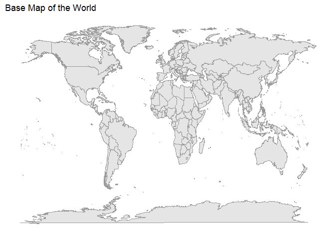
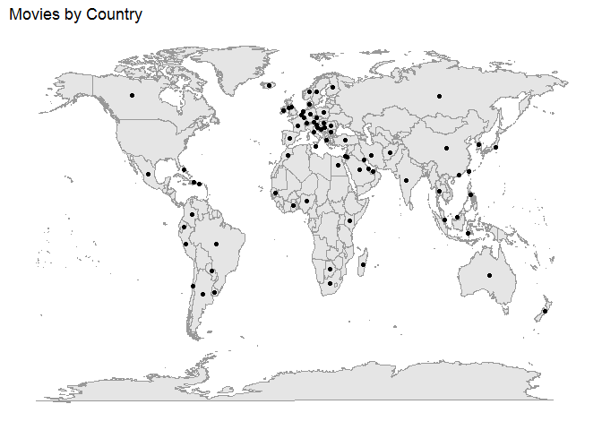
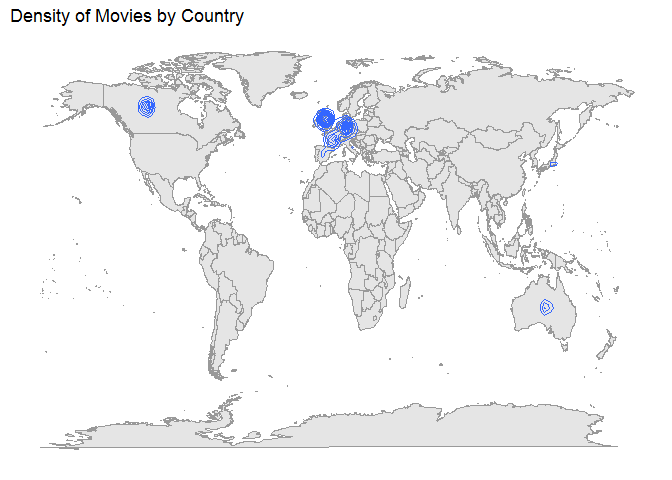
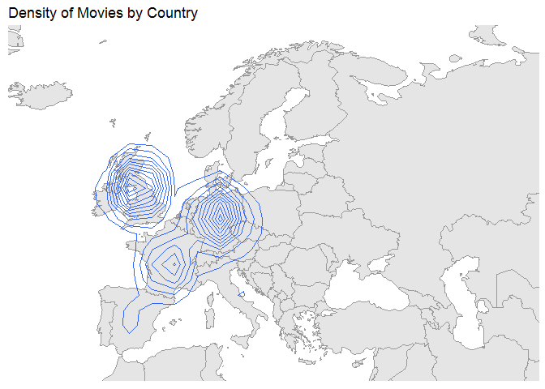
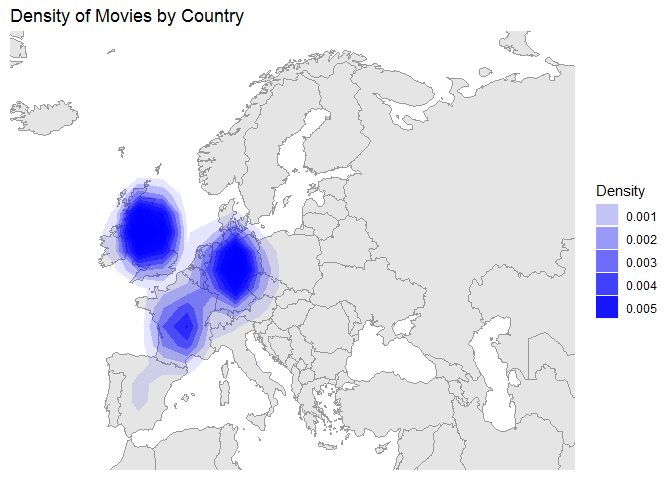
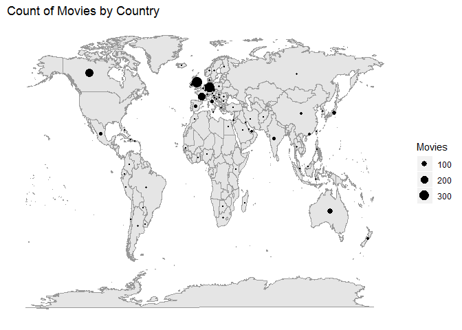
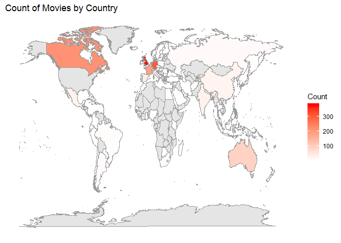
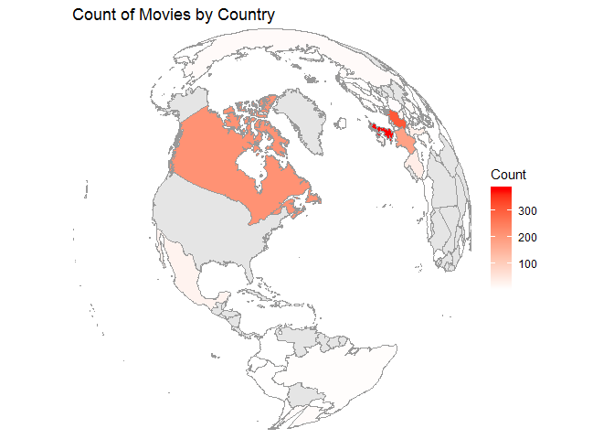

Mastering Data Visualization - Spatial Data
================

Spatial Data
============

Setting up environment

``` r
library(ggplot2)
library(dplyr)
```

    ## 
    ## Attaching package: 'dplyr'

    ## The following objects are masked from 'package:stats':
    ## 
    ##     filter, lag

    ## The following objects are masked from 'package:base':
    ## 
    ##     intersect, setdiff, setequal, union

Create a base map (no data)

``` r
ggplot() + 
  borders(
    database = "world",
    colour = "grey60",
    fill = "grey90") +
  ggtitle("Base Map of the World") +
  xlab("") + 
  ylab("") +
  theme(
    panel.background = element_blank() ,
    axis.title.x = element_blank(),
    axis.text.x = element_blank(),
    axis.ticks.x = element_blank(),
    axis.title.y = element_blank(),
    axis.text.y = element_blank(),
    axis.ticks.y = element_blank())
```

    ## Warning: package 'maps' was built under R version 3.5.3



Load the data

``` r
movies <- read.csv("../data/Movies by Country.csv")
countries <- read.csv("../data/Countries.csv")
head(movies)
```

    ##               Title Country Longitude Latitude
    ## 1         Gladiator      UK  -2.69531 54.75844
    ## 2 Big Momma's House Germany  10.50000 51.50000
    ## 3             Shaft Germany  10.50000 51.50000
    ## 4       Chicken Run      UK  -2.69531 54.75844
    ## 5       Chicken Run  France   2.00000 46.00000
    ## 6       The Patriot Germany  10.50000 51.50000

Dot Density Map
---------------

``` r
mymovies <- ggplot(data = movies) +
  borders(
    database = "world",
    colour = "grey60",
    fill = "grey90") +
  xlab("") +
  ylab("") +
  theme(
    panel.background = element_blank() ,
    axis.title.x = element_blank(),
    axis.text.x = element_blank(),
    axis.ticks.x = element_blank(),
    axis.title.y = element_blank(),
    axis.text.y = element_blank(),
    axis.ticks.y = element_blank())

mymovies +
  ggtitle("Movies by Country") +
  geom_point(
    aes(
      x = Longitude,
      y = Latitude))
```



Contour Map
-----------

``` r
mymovies +
  ggtitle("Density of Movies by Country") +
  geom_density2d(
    aes(
      x = Longitude,
      y = Latitude))
```



### Zoom into the map

``` r
mymovies +
  ggtitle("Density of Movies by Country") +
  coord_cartesian(
    xlim = c(-20,59),
    ylim = c(35,71)) +
  geom_density2d(
    aes(
    x = Longitude,
    y = Latitude))
```



Level Map
---------

``` r
mymovies +
  coord_cartesian(
    xlim = c(-20,59),
    ylim = c(35,71)) +
  stat_density2d(
    aes(
     x = Longitude,
     y = Latitude,
     alpha = ..level..),
    geom = "polygon",
    fill = "blue") +
  ggtitle("Density of Movies by Country") +
  labs(alpha = "Density")
```



Bubble Map
----------

``` r
mycountries <- ggplot(data = countries) +
  borders(
    database = "world",
    colour = "grey60",
    fill = "grey90") +
  xlab("") +
  ylab("") +
  theme(
    panel.background = element_blank() ,
    axis.title.x = element_blank(),
    axis.text.x = element_blank(),
    axis.ticks.x = element_blank(),
    axis.title.y = element_blank(),
    axis.text.y = element_blank(),
    axis.ticks.y = element_blank())


mycountries +
  geom_point(aes(
    x = Longitude,
    y = Latitude,
    size = Count)) +
  scale_size_area(
    max_size = 5) +
  ggtitle("Count of Movies by Country") +
  labs(size="Movies")
```



Load map data
-------------

``` r
map <- map_data("world")
head(map)
```

    ##        long      lat group order region subregion
    ## 1 -69.89912 12.45200     1     1  Aruba      <NA>
    ## 2 -69.89571 12.42300     1     2  Aruba      <NA>
    ## 3 -69.94219 12.43853     1     3  Aruba      <NA>
    ## 4 -70.00415 12.50049     1     4  Aruba      <NA>
    ## 5 -70.06612 12.54697     1     5  Aruba      <NA>
    ## 6 -70.05088 12.59707     1     6  Aruba      <NA>

Join countries and map data

``` r
countries2 <- countries  %>%
  left_join(map,
            by = c("Country" = "region")) %>%
  select(
    Country,
    Longitude = long,
    Latitude = lat,
    Group = group,
    Order = order,
    Count) %>%
  arrange(Order) %>%
  as.data.frame()
```

    ## Warning: Column `Country`/`region` joining factor and character vector,
    ## coercing into character vector

``` r
head(countries2)
```

    ##       Country Longitude Latitude Group Order Count
    ## 1 Afghanistan  74.89131 37.23164     2    12     1
    ## 2 Afghanistan  74.84023 37.22505     2    13     1
    ## 3 Afghanistan  74.76738 37.24917     2    14     1
    ## 4 Afghanistan  74.73896 37.28564     2    15     1
    ## 5 Afghanistan  74.72666 37.29072     2    16     1
    ## 6 Afghanistan  74.66895 37.26670     2    17     1

Choropletth
-----------

``` r
mycountries2 <- ggplot(
    data = countries2) + 
    borders(
        database = "world",
        colour = "grey60",
        fill = "grey90") +
    xlab("") +
    ylab("") +
    theme(
        panel.background = element_blank(),
        axis.title.x=element_blank(),
        axis.text.x=element_blank(),
        axis.ticks.x=element_blank(),
        axis.title.y=element_blank(),
        axis.text.y=element_blank(),
        axis.ticks.y=element_blank())

mycountries2 +
  geom_polygon(aes(
    x = Longitude,
    y = Latitude,
    group = Group,
    fill = Count),
    color = "grey60") +
  scale_fill_gradient(
    low = "white",
    high = "red") +
  ggtitle("Count of Movies by Country") +
  labs(color = "Movies")
```



Reproject a Map
---------------

``` r
mycountries2 +
  coord_map(
    projection = "ortho",
    orientation = c(41,-74,0)) +
  geom_polygon(aes(
    x = Longitude,
    y = Latitude,
    group = Group,
    fill = Count),
    color = "grey60") +
  scale_fill_gradient(
    low = "white",
    high = "red") +
  ggtitle("Count of Movies by Country") +
  labs(color = "Movies")
```



Additional Resources
====================

``` r
?mapproject
```

    ## starting httpd help server ... done
