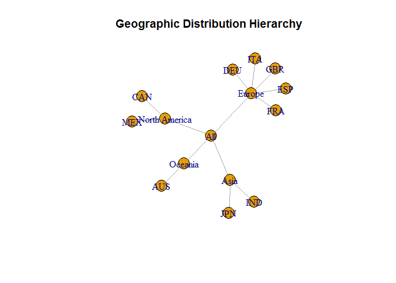
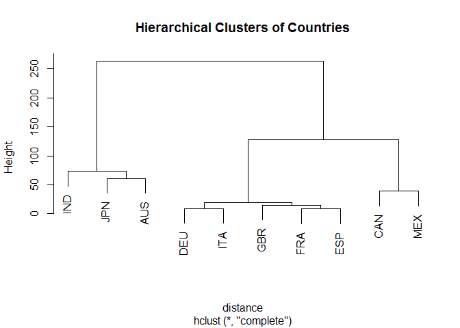
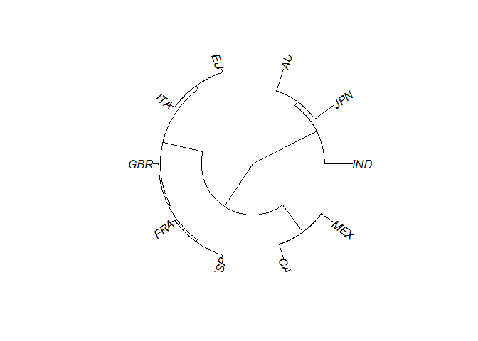
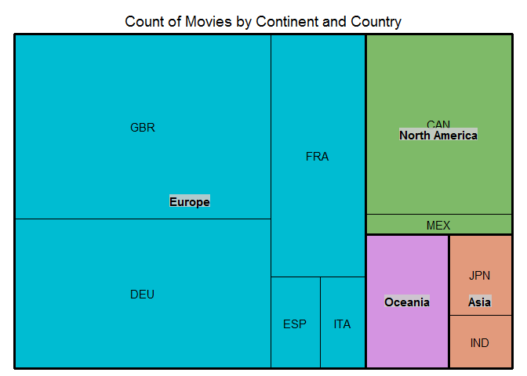
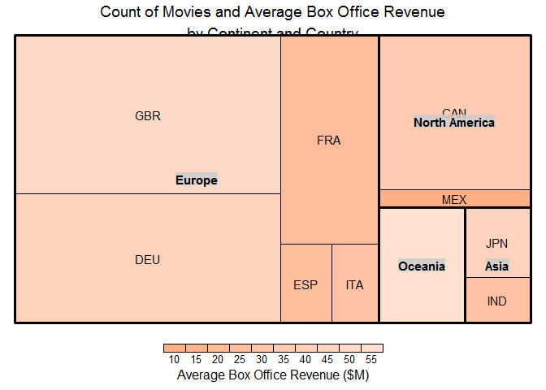

Mastering Data Visualization - Hierarchical Data Analysis
================

Hierarchical Data Analysis
==========================

Setting up environment

``` r
library(data.tree)
```

    ## Warning: package 'data.tree' was built under R version 3.5.3

``` r
library(igraph)
```

    ## Warning: package 'igraph' was built under R version 3.5.3

    ## 
    ## Attaching package: 'igraph'

    ## The following objects are masked from 'package:stats':
    ## 
    ##     decompose, spectrum

    ## The following object is masked from 'package:base':
    ## 
    ##     union

``` r
library(ape)
```

    ## Warning: package 'ape' was built under R version 3.5.3

    ## 
    ## Attaching package: 'ape'

    ## The following objects are masked from 'package:igraph':
    ## 
    ##     edges, mst, ring

``` r
library(treemap)
```

    ## Warning: package 'treemap' was built under R version 3.5.3

``` r
hierarchy <- read.csv("../data/Hierarchy.csv")
hierarchy$Path <- paste(
  "All",
  hierarchy$Continent,
  hierarchy$Country,
  sep = "/")
```

``` r
tree <- as.Node(
  x = hierarchy,
  pathName = "Path")
print(tree, limit = 10)
```

    ##                       levelName
    ## 1  All                         
    ## 2   ¦--Asia                    
    ## 3   ¦   ¦--IND                 
    ## 4   ¦   °--JPN                 
    ## 5   ¦--Europe                  
    ## 6   ¦   ¦--FRA                 
    ## 7   ¦   ¦--DEU                 
    ## 8   ¦   ¦--ITA                 
    ## 9   ¦   ¦--ESP                 
    ## 10  ¦   °--... 1 nodes w/ 0 sub
    ## 11  °--... 2 nodes w/ 4 sub

Charts/Plots
============

Tree Diagram
------------

``` r
# is not rendered on R Notebook file
#plot(tree)
```

Tree Graph
----------

Create a tree graph

``` r
treeGraph <- as.igraph(tree)
plot(
  x = treeGraph,
  main = "Geographic Distribution Hierarchy")
```



Dendrogram
----------

Add row names for dendro labels

``` r
row.names(hierarchy) <- hierarchy$Country
head(hierarchy,5)
```

    ##     Continent Country Longitude Latitude Count Box.Office           Path
    ## IND      Asia     IND  77.00000 20.00000    27   28.32714   All/Asia/IND
    ## JPN      Asia     JPN 139.75309 35.68536    41   43.15009   All/Asia/JPN
    ## FRA    Europe     FRA   2.00000 46.00000   184   23.31596 All/Europe/FRA
    ## DEU    Europe     DEU  10.50000 51.50000   306   42.16073 All/Europe/DEU
    ## ITA    Europe     ITA  12.83333 42.83333    33   28.57730 All/Europe/ITA

``` r
distance <- dist(hierarchy[,c(3,4)])
round(distance, 0)
```

    ##     IND JPN FRA DEU ITA ESP GBR CAN MEX
    ## JPN  65                                
    ## FRA  79 138                            
    ## DEU  74 130  10                        
    ## ITA  68 127  11   9                    
    ## ESP  83 144   8  19  17                
    ## GBR  87 144  10  14  20  15            
    ## CAN 195 255 117 124 128 111 111        
    ## MEX 179 242 107 116 117  99 104  39    
    ## AUS  73  61 151 146 140 153 159 263 242

Create hierarchical clusters

``` r
clusters <- hclust(distance)
```

Plot

``` r
plot(
  x = clusters <- hclust(distance),
  main = "Hierarchical Clusters of Countries")
```



Radial Tree
-----------

Create a phylogenic tree
========================

``` r
phylo <- as.phylo(clusters)
```

Plot

``` r
plot(
  x = phylo,
  type = "fan")
```



Tree Map

Create a frequency treemap

``` r
treemap(
  dtf = hierarchy,
  index = c("Continent","Country"),
  vSize = "Count",
  vColor = "Continent",
  type = "categorical",
  title = "Count of Movies by Continent and Country",
  position.legend = "none")
```



Create a treemap

``` r
treemap(
  dtf = hierarchy,
  index = c("Continent","Country"),
  vSize = "Count",
  vColor = "Box.Office",
  type = "value",
  palette = c("#FF681D", "#FFE1D2"),
  title = "Count of Movies and Average Box Office Revenue\nby Continent and Country",
    title.legend = "Average Box Office Revenue ($M)")
```


