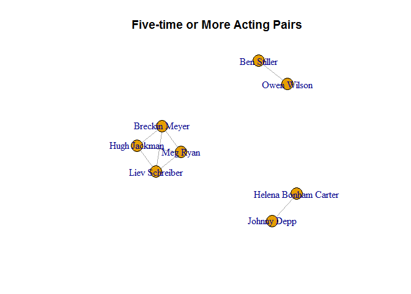
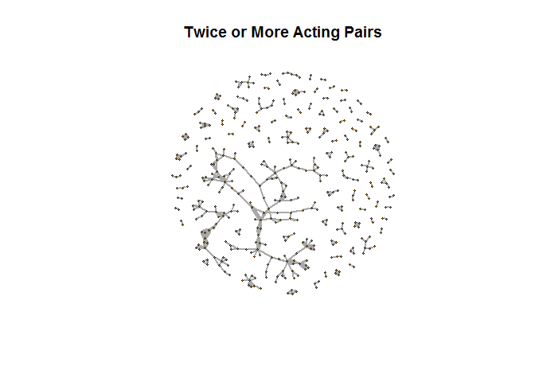
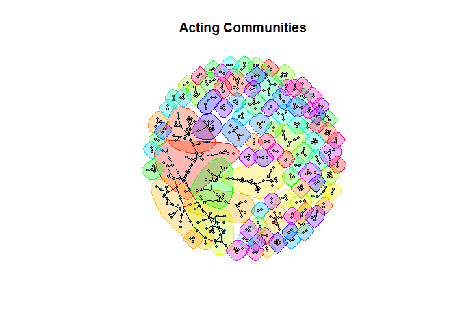

Mastering Data Visualization - Graph and Network Data
================

Visualizing Graph and Network Data
==================================

Setting up environment

``` r
library(igraph)
```

    ## Warning: package 'igraph' was built under R version 3.5.3

    ## 
    ## Attaching package: 'igraph'

    ## The following objects are masked from 'package:stats':
    ## 
    ##     decompose, spectrum

    ## The following object is masked from 'package:base':
    ## 
    ##     union

``` r
actors <- read.csv("../data/Actors.csv")
head(actors)
```

    ##     Actor                  Partner Count
    ## 1 50 Cent Adewale Akinnuoye-Agbaje     1
    ## 2 50 Cent                Al Pacino     1
    ## 3 50 Cent             Carla Gugino     1
    ## 4 50 Cent               Joy Bryant     1
    ## 5 50 Cent       Omar Benson Miller     1
    ## 6 50 Cent           Robert De Niro     1

``` r
actors5 <- actors[actors$Count >= 5,]

graph5 <- graph.data.frame(
  d = actors5,
  directed = FALSE)
```

Charts/Plots
============

Small Graph
-----------

``` r
plot(
  x = graph5,
  edge.curved = FALSE,
  main = "Five-time or More Acting Pairs")
```



Large Graph
-----------

### Create undirected graph object

``` r
actors2 <- actors[actors$Count >= 2,]

graph2 <- graph.data.frame(
  d = actors2,
  directed  = FALSE)
```

``` r
plot(
  x = graph2,
  vertex.size = 2,
  vertex.label = NA,
  edge.curved = FALSE,
  edge.width = edge_attr(graph2)$Count,
  main = "Twice or More Acting Pairs")
```



Community Graph
---------------

``` r
clusters <- cluster_edge_betweenness(graph2)
plot(
  x =  clusters,
  y = graph2,
  vertex.size = 3,
  vertex.label = NA,
  edge.curved = FALSE,
  main = "Acting Communities")
```


