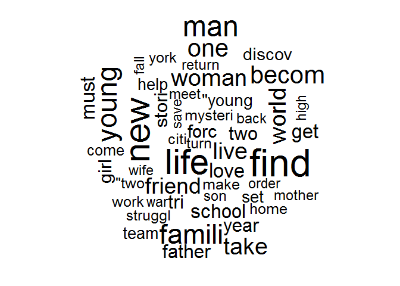
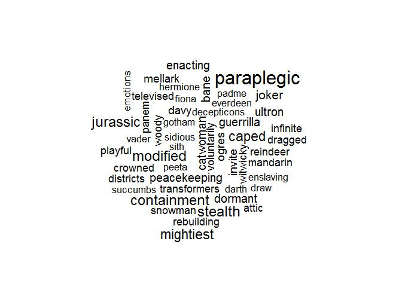
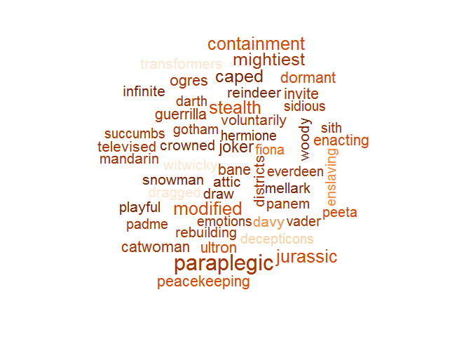

Mastering Data Visualization - Text Data
================

Visualizing Text Data
=====================

Text Data Analysis
------------------

Setting up environment

``` r
library(tm) # text mining package
```

    ## Warning: package 'tm' was built under R version 3.5.3

    ## Loading required package: NLP

    ## Warning: package 'NLP' was built under R version 3.5.2

``` r
library(SnowballC)
```

    ## Warning: package 'SnowballC' was built under R version 3.5.2

``` r
library(wordcloud)
```

    ## Warning: package 'wordcloud' was built under R version 3.5.3

    ## Loading required package: RColorBrewer

``` r
library(RColorBrewer)
plots <- read.csv("../data/Plots.csv")
plots$Plot <- as.character(plots$Plot)
head(plots$Plot, 3)
```

    ## [1] "Nick is a struggling dentist in Canada. A new neighbor moves in, and he discovers that it is Jimmy \"The Tulip\" Teduski. His wife convinces him to go to Chicago and inform the mob boss who wants Jimmy dead."
    ## [2] "A child is born. We see underwater swimmers representing this. He is young, in a jungle setting, with two fanciful \"instincts\" guiding him as swooping bird-like acrobats initially menace, ..."              
    ## [3] "When a Roman general is betrayed and his family murdered by an emperor's corrupt son, he comes to Rome as a gladiator to seek revenge."

Convert plots into corpus

``` r
corpus <- Corpus(VectorSource(plots$Plot))
corpus[[1]]$content
```

    ## [1] "Nick is a struggling dentist in Canada. A new neighbor moves in, and he discovers that it is Jimmy \"The Tulip\" Teduski. His wife convinces him to go to Chicago and inform the mob boss who wants Jimmy dead."

Convert text to lower case

``` r
corpus <- tm_map(corpus, content_transformer(tolower))
```

    ## Warning in tm_map.SimpleCorpus(corpus, content_transformer(tolower)):
    ## transformation drops documents

Remove punctuation

``` r
corpus <- tm_map(corpus, removePunctuation)
```

    ## Warning in tm_map.SimpleCorpus(corpus, removePunctuation): transformation
    ## drops documents

Remove stop words from corpus

``` r
corpus <- tm_map(corpus, removeWords, stopwords("english"))
```

    ## Warning in tm_map.SimpleCorpus(corpus, removeWords, stopwords("english")):
    ## transformation drops documents

Reduce terms to stems in corpus

``` r
corpus <- tm_map(corpus, stemDocument, "english")
```

    ## Warning in tm_map.SimpleCorpus(corpus, stemDocument, "english"):
    ## transformation drops documents

Strip whitespace from corpus

``` r
corpus <- tm_map(corpus, stripWhitespace)
```

    ## Warning in tm_map.SimpleCorpus(corpus, stripWhitespace): transformation
    ## drops documents

Convert corpus to text document

``` r
corpus <- tm_map(corpus, PlainTextDocument)
```

    ## Warning in tm_map.SimpleCorpus(corpus, PlainTextDocument): transformation
    ## drops documents

Taking a look at the current result

``` r
head(corpus[[1]]$content)
```

    ## [1] "nick struggl dentist canada new neighbor move discov jimmi tulip teduski wife convinc go chicago inform mob boss want jimmi dead"
    ## [2] "child born see underwat swimmer repres young jungl set two fanci instinct guid swoop birdlik acrobat initi menac"                
    ## [3] "roman general betray famili murder emperor corrupt son come rome gladiat seek reveng"                                            
    ## [4] "orphan dinosaur rais lemur join arduous trek sancturari meteorit shower destroy famili home"                                     
    ## [5] "fbi agent disguis old ladi protect beauti feder wit son"                                                                         
    ## [6] "retir master car thief must come back industri steal 50 car crew one night save brother life"

Charts/Plots
============

Frequency Word Cloud
--------------------

Create a frequency word cloud

``` r
wordcloud(
    words = corpus[1],
    max.words = 50)
```



Quantitative Word Cloud
-----------------------

Setting up environtment

``` r
words <- read.csv("../data/Words.csv")
head(words, n=10)
```

    ##         Term Count Box.Office Critic.Score
    ## 1        aaa     1      31.00         6.00
    ## 2       aang     1     131.60         6.00
    ## 3      aaron     2      43.10        71.50
    ## 4      aback     1      25.80        13.00
    ## 5   abagnale     1     164.40        96.00
    ## 6    abandon     1      23.30        12.00
    ## 7  abandoned    10      52.97        53.70
    ## 8   abandons     3      26.07        68.67
    ## 9       abba     1     143.70        54.00
    ## 10    abbate     1       0.40        50.00

``` r
wordcloud(
  words = words$Term,
  freq = words$Box.Office,
  max.words = 50,
  scale = c(2,0.1))
```



Colored Word Cloud
------------------

``` r
palette <- brewer.pal(
  n = 9,
  name = "Oranges")

colors <- palette[cut(words$Critic.Score, 9)]

wordcloud(
  words = words$Term,
  freq = words$Box.Office,
  max.words = 50,
  scale = c(2,0.5),
  colors = colors,
  ordered.colors = TRUE)
```


