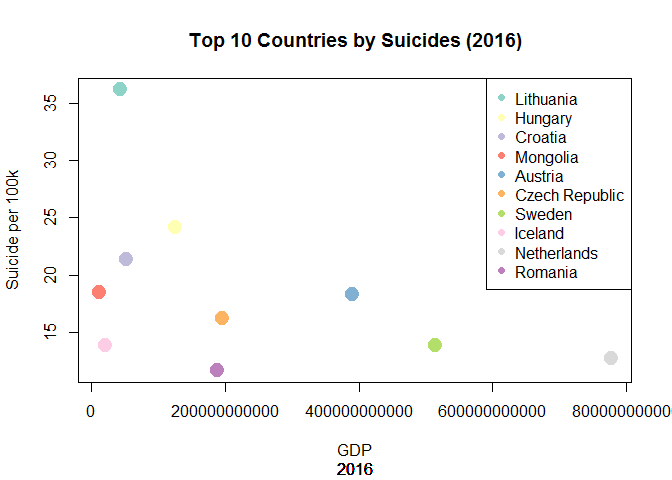

Animating Data Visualization
================

Setting up environment

For the sake of keep things simple for this exercise, I am taking top ten countries for 2016 and see the behavior from 1985...

``` r
library(RColorBrewer)
library(tidyverse)
```

    ## Warning: package 'tidyverse' was built under R version 3.5.2

    ## -- Attaching packages ----------------------------------------------------------------------- tidyverse 1.2.1 --

    ## v ggplot2 3.0.0     v purrr   0.2.5
    ## v tibble  1.4.2     v dplyr   0.7.6
    ## v tidyr   0.8.1     v stringr 1.3.1
    ## v readr   1.1.1     v forcats 0.3.0

    ## -- Conflicts -------------------------------------------------------------------------- tidyverse_conflicts() --
    ## x dplyr::filter() masks stats::filter()
    ## x dplyr::lag()    masks stats::lag()

``` r
library(stringr)
options(scipen=999)
palette <- brewer.pal(10,"Set3")

suicides_dataset <- read.csv("../data/SuicideRatesOverview1985-to-2016.csv")

top10_suicides_countries <- suicides_dataset %>%
  filter(year == 2016) %>%
  select(country, year, suicides.100k.pop, gdp_for_year....) %>%
  group_by(year, country, gdp_for_year....) %>%
  summarize(suicides.100k.pop = sum(suicides.100k.pop)/n())%>%
  ungroup() %>%
  mutate(gdp_for_year.... =as.numeric(str_replace_all(gdp_for_year....,",","")))%>%
  arrange(desc(suicides.100k.pop)) %>%
  top_n(10) %>%
  mutate(color = row_number())
```

    ## Selecting by suicides.100k.pop

Let's try our chart for 2016

``` r
plot(
  x = top10_suicides_countries$gdp_for_year....,
  y = top10_suicides_countries$suicides.100k.pop,
  col = palette[top10_suicides_countries$color],
  pch = 19,
  cex = 2,
  main = "Top 10 Countries by Suicides (2016)",
  xlab = "GDP",
  ylab = "Suicide per 100k",
  sub = top10_suicides_countries$year)

legend(
  x = "topright",
  as.character(top10_suicides_countries$country),
  col = palette[top10_suicides_countries$color],
  pch = 19,
  cex = 1)
```



Delete unneeded columns

``` r
top10_suicides_countries$year <- NULL
top10_suicides_countries$gdp_for_year.... <- NULL
top10_suicides_countries$suicides.100k.pop <- NULL
```

Animation
---------

### Animation to tell a story

#### Animation functions

``` r
#browser()
#Get the required data

top10_suicide_subset <- suicides_dataset %>%
  filter(country %in% top10_suicides_countries$country) %>%
  select(year, country,  gdp_for_year...., suicides.100k.pop) %>%
  mutate(gdp_for_year.... = as.numeric(str_replace_all(gdp_for_year....,",",""))/1000000) %>%
  group_by(year, country,  gdp_for_year....) %>%
  summarize(suicides.100k.pop = sum(suicides.100k.pop)/n()) %>%
  ungroup() %>%
  merge(top10_suicides_countries, by = "country") 
  

x_max_value = max(top10_suicide_subset$gdp_for_year....) 
x_min_value = min(top10_suicide_subset$gdp_for_year....)

animate_suicide_plot <- function(){
  for(i in 1985:2016){
    year <- i
    
    year_subset <- top10_suicide_subset %>%
      filter(year == i)
    
    plot(
      x = year_subset$gdp_for_year....,
      y = year_subset$suicides.100k.pop,
      col = palette[year_subset$color],
      pch = 19,
      cex = 2,
      xlim = c(x_min_value, x_max_value),
      ylim = c(0,80),
      main = "Top 10 Countries by Suicide in 2016 through time",
      xlab = "GDP ($M)",
      ylab = "Suicide per 100k",
      sub = year_subset$year)
   
    
    
    legend(
      x = "topright",
      as.character(year_subset$country),
      col = palette[year_subset$color],
      pch = 19,
      cex = 1)
    
    print(plot)
  }
}
```

#### Animation package

``` r
library(animation)

ffmpeg_path <- "C:/Program Files/ffmpeg/bin/ffmpeg.exe"
ffmpeg_opts <- "-r 15 -pix_fmt yuv420p"
# Animation parameters
ani.options(
  interval = 1, #0.067,
  ani.width = 640,
  ani.height = 480)

# Save the animation as a video
saveVideo(
  expr = animate_suicide_plot(),
  video.name = "../figs/Suicide_1985-2016.mp4",
  ffmpeg = ffmpeg_path,
  other.opts = ffmpeg_opts)
```
