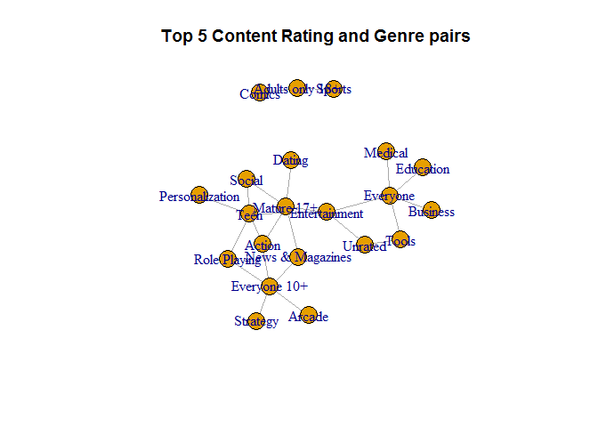
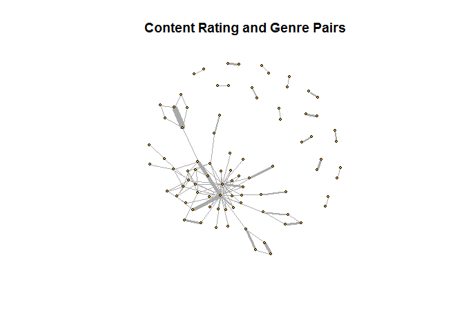
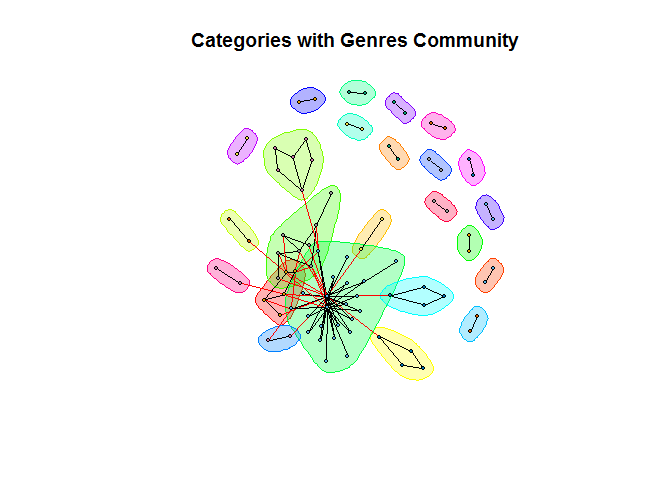

Graph and Network Data
================

Setting up environment

``` r
library(tidyverse)
```

    ## Warning: package 'tidyverse' was built under R version 3.5.2

    ## -- Attaching packages ----------------------------------------------------------------------- tidyverse 1.2.1 --

    ## v ggplot2 3.0.0     v purrr   0.2.5
    ## v tibble  1.4.2     v dplyr   0.7.6
    ## v tidyr   0.8.1     v stringr 1.3.1
    ## v readr   1.1.1     v forcats 0.3.0

    ## -- Conflicts -------------------------------------------------------------------------- tidyverse_conflicts() --
    ## x dplyr::filter() masks stats::filter()
    ## x dplyr::lag()    masks stats::lag()

``` r
library(igraph)
```

    ## Warning: package 'igraph' was built under R version 3.5.3

    ## 
    ## Attaching package: 'igraph'

    ## The following objects are masked from 'package:dplyr':
    ## 
    ##     as_data_frame, groups, union

    ## The following objects are masked from 'package:purrr':
    ## 
    ##     compose, simplify

    ## The following object is masked from 'package:tidyr':
    ## 
    ##     crossing

    ## The following object is masked from 'package:tibble':
    ## 
    ##     as_data_frame

    ## The following objects are masked from 'package:stats':
    ## 
    ##     decompose, spectrum

    ## The following object is masked from 'package:base':
    ## 
    ##     union

``` r
load("../rda/apps_versions_dataset.rda")
load("../rda/apps_genres_dataset.rda")
load("../rda/apps_categories_dataset.rda")
apps_dataset <- apps_versions_dataset %>%
  merge(apps_genres_dataset, by = "App") %>%
  merge(apps_categories_dataset, by = "App") %>%
  select(Content.Rating,Genre,App, Category)

apps_genres_dataset <- NULL
apps_versions_dataset <- NULL
apps_categories_dataset <- NULL
```

Small Graph
-----------

``` r
apps_subset <- apps_dataset %>%
  select(Content.Rating, Genre, App) %>%
  group_by(Content.Rating, Genre) %>%
  distinct() %>%
  summarize(Count = n()) %>%
  arrange(Content.Rating, Count) %>%
  top_n(n = 5)
```

    ## Selecting by Count

``` r
smallGraph <- graph.data.frame(
  d = apps_subset,
  directed = FALSE)

plot(
  x = smallGraph,
  edge.curved = FALSE,
  main = "Top 5 Content Rating and Genre pairs")
```



Large Graph
-----------

``` r
apps_subset <- apps_dataset %>%
  select(Category, Genre, App) %>%
  distinct() %>%
  group_by(Category, Genre) %>%
  summarize(Count = n())


largeGraph <- graph.data.frame(
    d = apps_subset,
    directed = FALSE)

plot(
  x = largeGraph,
  vertex.size = 3,
  vertex.label = NA,
  edge.curved = FALSE,
  edge.width = edge_attr(largeGraph)$Count/100,
  main = "Content Rating and Genre Pairs")
```



Community Graph
---------------

``` r
clusters <-cluster_edge_betweenness(largeGraph)
plot(
  x = clusters,
  y = largeGraph,
  vertex.size = 3,
  vertex.label = NA,
  edge.curved = FALSE,
  main = "Categories with Genres Community")
```


