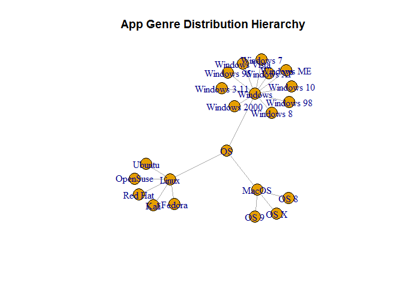
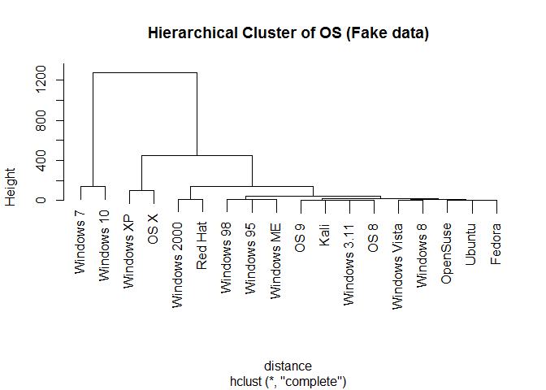
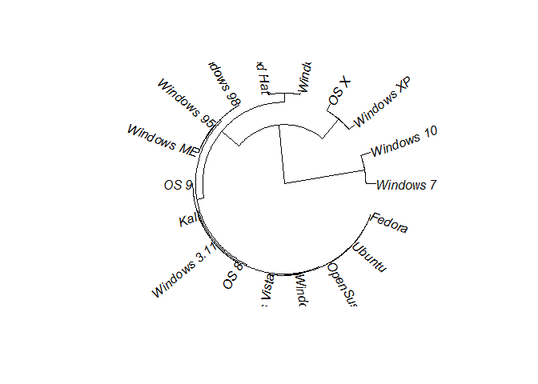
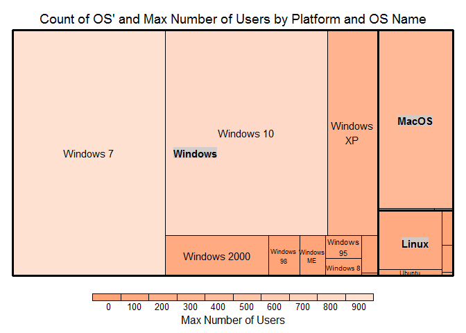

Hierarchical Data Analysis
================

Setting up environment

**PLEASE NOTE: These are FAKE Values**

``` r
library(data.tree)
```

    ## Warning: package 'data.tree' was built under R version 3.5.3

``` r
library(igraph)
```

    ## Warning: package 'igraph' was built under R version 3.5.3

    ## 
    ## Attaching package: 'igraph'

    ## The following objects are masked from 'package:stats':
    ## 
    ##     decompose, spectrum

    ## The following object is masked from 'package:base':
    ## 
    ##     union

``` r
library(ape)
```

    ## Warning: package 'ape' was built under R version 3.5.3

    ## 
    ## Attaching package: 'ape'

    ## The following objects are masked from 'package:igraph':
    ## 
    ##     edges, mst, ring

``` r
library(treemap)
```

    ## Warning: package 'treemap' was built under R version 3.5.3

``` r
os_dataset <- read.csv("../data/OperatingSystems.csv", as.is = c("Name"))

os_dataset$Path <-  paste("OS",
                          os_dataset$Platform,
                          os_dataset$Name,
                          sep="/")
  

tree <- as.Node(
  x = os_dataset,
  pathName = "Path")

print(tree, limit = 10)
```

    ##                       levelName
    ## 1  OS                          
    ## 2   ¦--Windows                 
    ## 3   ¦   ¦--Windows 3.11        
    ## 4   ¦   ¦--Windows 95          
    ## 5   ¦   ¦--Windows 98          
    ## 6   ¦   ¦--Windows ME          
    ## 7   ¦   ¦--Windows 2000        
    ## 8   ¦   ¦--Windows XP          
    ## 9   ¦   ¦--Windows Vista       
    ## 10  ¦   °--... 3 nodes w/ 0 sub
    ## 11  °--... 2 nodes w/ 11 sub

Tree Diagram
------------

``` r
treeGraph <- as.igraph(tree)
#igraph.options(plot.layout = layout.circle, vertex.size=5, node.size = .5) #(plot.layout=layout_as_tree)
#vertex.size=5
igraph.options(vertex.size=15, plot.layout=layout.auto)
plot(
  x = treeGraph,
  main = "App Genre Distribution Hierarchy")
```



Dendrogram
----------

``` r
row.names(os_dataset) <- os_dataset$Name
head(os_dataset)
```

    ##              Platform         Name   Type Max.Num.Users Abbr
    ## Windows 3.11  Windows Windows 3.11 Client             1   W3
    ## Windows 95    Windows   Windows 95 Client            20  W95
    ## Windows 98    Windows   Windows 98 Client            30  W98
    ## Windows ME    Windows   Windows ME Client            25  WME
    ## Windows 2000  Windows Windows 2000 Client           100  W2K
    ## Windows XP    Windows   Windows XP Client           250  WXP
    ##                                 Path
    ## Windows 3.11 OS/Windows/Windows 3.11
    ## Windows 95     OS/Windows/Windows 95
    ## Windows 98     OS/Windows/Windows 98
    ## Windows ME     OS/Windows/Windows ME
    ## Windows 2000 OS/Windows/Windows 2000
    ## Windows XP     OS/Windows/Windows XP

``` r
distance <- dist(os_dataset[,c(1,4)])
```

    ## Warning in dist(os_dataset[, c(1, 4)]): NAs introduced by coercion

``` r
attr(distance,"Labels") <- os_dataset$Name
print(distance)
```

    ##               Windows 3.11  Windows 95  Windows 98  Windows ME
    ## Windows 95       26.870058                                    
    ## Windows 98       41.012193   14.142136                        
    ## Windows ME       33.941125    7.071068    7.071068            
    ## Windows 2000    140.007143  113.137085   98.994949  106.066017
    ## Windows XP      352.139177  325.269119  311.126984  318.198052
    ## Windows Vista    19.798990    7.071068   21.213203   14.142136
    ## Windows 7      1271.377993 1244.507935 1230.365799 1237.436867
    ## Windows 8        19.798990    7.071068   21.213203   14.142136
    ## Windows 10     1129.956636 1103.086579 1088.944443 1096.015511
    ## OS 8              0.000000   26.870058   41.012193   33.941125
    ## OS 9              2.828427   24.041631   38.183766   31.112698
    ## OS X            451.134126  424.264069  410.121933  417.193001
    ## OpenSuse          8.485281   18.384776   32.526912   25.455844
    ## Ubuntu           12.727922   14.142136   28.284271   21.213203
    ## Fedora           11.313708   15.556349   29.698485   22.627417
    ## Kali              0.000000   26.870058   41.012193   33.941125
    ## Red Hat         125.865007   98.994949   84.852814   91.923882
    ##               Windows 2000  Windows XP Windows Vista   Windows 7
    ## Windows 95                                                      
    ## Windows 98                                                      
    ## Windows ME                                                      
    ## Windows 2000                                                    
    ## Windows XP      212.132034                                      
    ## Windows Vista   120.208153  332.340187                          
    ## Windows 7      1131.370850  919.238816   1251.579003            
    ## Windows 8       120.208153  332.340187      0.000000 1251.579003
    ## Windows 10      989.949494  777.817459   1110.157646  141.421356
    ## OS 8            140.007143  352.139177     19.798990 1271.377993
    ## OS 9            137.178716  349.310750     16.970563 1268.549565
    ## OS X            311.126984   98.994949    431.335137  820.243866
    ## OpenSuse        131.521861  343.653896     11.313708 1262.892711
    ## Ubuntu          127.279221  339.411255      7.071068 1258.650071
    ## Fedora          128.693434  340.825469      8.485281 1260.064284
    ## Kali            140.007143  352.139177     19.798990 1271.377993
    ## Red Hat          14.142136  226.274170    106.066017 1145.512986
    ##                 Windows 8  Windows 10        OS 8        OS 9        OS X
    ## Windows 95                                                               
    ## Windows 98                                                               
    ## Windows ME                                                               
    ## Windows 2000                                                             
    ## Windows XP                                                               
    ## Windows Vista                                                            
    ## Windows 7                                                                
    ## Windows 8                                                                
    ## Windows 10    1110.157646                                                
    ## OS 8            19.798990 1129.956636                                    
    ## OS 9            16.970563 1127.128209    2.828427                        
    ## OS X           431.335137  678.822510  451.134126  448.305699            
    ## OpenSuse        11.313708 1121.471355    8.485281    5.656854  442.648845
    ## Ubuntu           7.071068 1117.228714   12.727922    9.899495  438.406204
    ## Fedora           8.485281 1118.642928   11.313708    8.485281  439.820418
    ## Kali            19.798990 1129.956636    0.000000    2.828427  451.134126
    ## Red Hat        106.066017 1004.091629  125.865007  123.036580  325.269119
    ##                  OpenSuse      Ubuntu      Fedora        Kali
    ## Windows 95                                                   
    ## Windows 98                                                   
    ## Windows ME                                                   
    ## Windows 2000                                                 
    ## Windows XP                                                   
    ## Windows Vista                                                
    ## Windows 7                                                    
    ## Windows 8                                                    
    ## Windows 10                                                   
    ## OS 8                                                         
    ## OS 9                                                         
    ## OS X                                                         
    ## OpenSuse                                                     
    ## Ubuntu           4.242641                                    
    ## Fedora           2.828427    1.414214                        
    ## Kali             8.485281   12.727922   11.313708            
    ## Red Hat        117.379726  113.137085  114.551299  125.865007

Create hierarchical clusters

``` r
clusters <- hclust(distance)

plot(
  x = clusters,
  main ="Hierarchical Cluster of OS (Fake data)")
```



Radial Tree
-----------

``` r
phylo <- as.phylo(clusters)
plot(
  x = phylo,
  type = "fan")
```



Tree Map
--------

``` r
treemap(
  dtf = os_dataset,
  index = c("Platform","Name"),
  vSize = "Max.Num.Users",
  vColor = "Max.Num.Users",
  type = "value",
  palette = c("#FF681D", "#FFE1D2"),
  title = "Count of OS' and Max Number of Users by Platform and OS Name",
  title.legend = "Max Number of Users")
```


