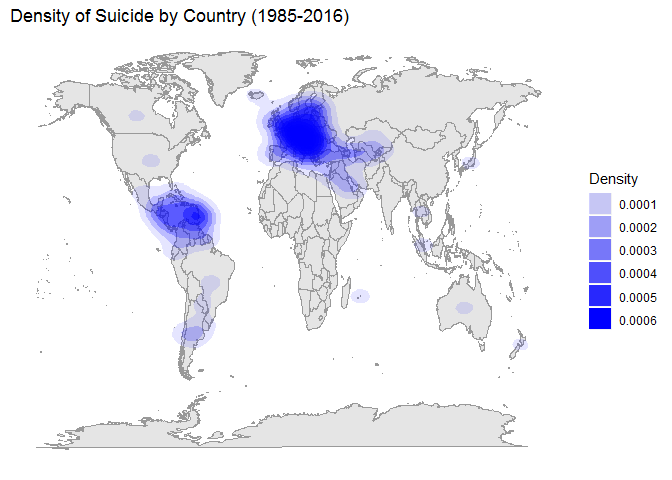

Spatial Data
================

*Note:* The main goal for this exercise is to practice data visualization for spatial data, no data wrangling or any other phase in the process, so the code is going to be kept to the minumum and focus to the goal, only where it makes sense I will clean up the data.

Setting up environment

``` r
library(tidyverse)
```

    ## Warning: package 'tidyverse' was built under R version 3.5.2

    ## -- Attaching packages ----------------------------------------------------------------------- tidyverse 1.2.1 --

    ## v ggplot2 3.0.0     v purrr   0.2.5
    ## v tibble  1.4.2     v dplyr   0.7.6
    ## v tidyr   0.8.1     v stringr 1.3.1
    ## v readr   1.1.1     v forcats 0.3.0

    ## -- Conflicts -------------------------------------------------------------------------- tidyverse_conflicts() --
    ## x dplyr::filter() masks stats::filter()
    ## x dplyr::lag()    masks stats::lag()

``` r
countries_geodata <- read.csv("../data/CountryMapCoordinates.csv")
suicide_rates_dataset <- read.csv("../data/SuicideRatesOverview1985-to-2016.csv")
suicide_dataset <- suicide_rates_dataset %>%
  merge(countries_geodata, by.x = "country", by.y = "name")

#countries_geodata <- NULL
#suicide_rates_dataset <- NULL
```

Plots
=====

Generating base GGPlot Plot

``` r
myplot <- ggplot() +
  xlab("") +
  ylab("") +
  theme(
    panel.background = element_blank(),
    axis.title.x =element_blank(),
    axis.text.x = element_blank(),
    axis.ticks.x = element_blank(),
    axis.title.y =element_blank(),
    axis.text.y = element_blank(),
    axis.ticks.y = element_blank())
  
myplot +
  ggtitle("Base Map of the world!") +
  borders(
    database = "world",
    colour = "grey60",
    fill = "grey90")
```

    ## Warning: package 'maps' was built under R version 3.5.3

    ## 
    ## Attaching package: 'maps'

    ## The following object is masked from 'package:purrr':
    ## 
    ##     map


Dot Density Map
---------------

Let's see where we have suicide records, keep in mind this is a sample.

``` r
myplot +
  ggtitle("Suicide by Countries (1985 - 2016)") +
  borders(
    database = "world",
    colour = "gray60",
    fill = "grey90") +
  geom_point(
    data = suicide_dataset,
    aes(
      x = longitude,
      y = latitude))
```


Contour Map
-----------

Let's see how it is concentrated.

``` r
myplot +
  ggtitle("Density of Suicides by Country") +
  borders(
    database = "world",
    colour = "grey60",
    fill = "gray90") +
  geom_density2d(
    data = suicide_dataset,
    aes(
     x = longitude,
     y = latitude))
```


Let's zoom into Europe

``` r
myplot +
  ggtitle("Density of Suicides in Europe") +
  borders(
    database = "world",
    colour = "grey60",
    fill = "grey90") +
  geom_density2d(
    data = suicide_dataset,
    aes(
      x = longitude,
      y = latitude)) +
  coord_cartesian(
    xlim = c(-20,59),
    ylim = c(35,71))
```


Let's Zoom into Latin America

``` r
myplot +
  ggtitle("Density of Suicide in Latin America") +
  borders(
    database = "world",
    colour = "grey60",
    fill = "grey90") +
  geom_density2d(
    data = suicide_dataset,
    aes(
      x = longitude,
      y = latitude)) +
  coord_cartesian(
    xlim = c(-130,-35),
    ylim = c(30,-50))
```


Level Map
---------

``` r
options(scipen=999)
myplot +
  ggtitle("Density of Suicide by Country (1985-2016)") +
  borders(
    database = "world",
    colour = "grey60",
    fill = "grey90") +
  stat_density2d(
    data = suicide_dataset,
    aes(
      x = longitude,
      y = latitude,
      alpha = ..level..),
    geom = "polygon",
    fill = "blue") +
  labs(alpha = "Density")
```



Bubble Map
----------

I'm only displaying the total over the time, from 1985 and 2016, but we should pay attention to the proportion based on the total of people by country, so we may find countries with more total suicides but having larger population the proportion may be lower... We also may find some countries have less suicides ver time (and viceversa), I will display those examples in further exercises.

``` r
suicide_grouped_dataset <- suicide_dataset %>%
  select(country, suicides_no,longitude, latitude) %>%
  group_by(country, longitude, latitude) %>%
  summarize(Count = sum(suicides_no))

suicide_grouped_dataset %>%
  ggplot() +
  xlab("") +
  ylab("") +
  theme(
    panel.background = element_blank(),
    axis.title.x =element_blank(),
    axis.text.x = element_blank(),
    axis.ticks.x = element_blank(),
    axis.title.y =element_blank(),
    axis.text.y = element_blank(),
    axis.ticks.y = element_blank())+
  ggtitle("Count of Suicides by Country (1985-2016)") +
  borders(
    database = "world",
    colour = "grey60",
    fill = "grey90") +
  geom_point(
    aes(
      x = longitude,
      y = latitude,
      size = Count)) +
  labs(size = "Suicides")
```


Map Data
--------

``` r
map <- map_data("world")
head(map)
```

    ##        long      lat group order region subregion
    ## 1 -69.89912 12.45200     1     1  Aruba      <NA>
    ## 2 -69.89571 12.42300     1     2  Aruba      <NA>
    ## 3 -69.94219 12.43853     1     3  Aruba      <NA>
    ## 4 -70.00415 12.50049     1     4  Aruba      <NA>
    ## 5 -70.06612 12.54697     1     5  Aruba      <NA>
    ## 6 -70.05088 12.59707     1     6  Aruba      <NA>

``` r
suicide_dataset <- suicide_rates_dataset %>%
  left_join(map, by =c("country" = "region")) %>%
  select(
    country,
    Longitude = long,
    Latitude = lat,
    Group = group,
    Order = order,
    Suicides100k = suicides.100k.pop) %>%
  arrange(Order) %>%
  as.data.frame()
```

    ## Warning: Column `country`/`region` joining factor and character vector,
    ## coercing into character vector

Choropleth
----------

``` r
ggplot(data = suicide_dataset) +
  borders(
    database = "world",
    colour = "grey60",
    fill = "grey90") +
  xlab("") +
  ylab("") +
  theme( panel.background = element_blank(),
      axis.title.x=element_blank(),
      axis.text.x=element_blank(),
      axis.ticks.x=element_blank(),
      axis.title.y=element_blank(),
      axis.text.y=element_blank(),
      axis.ticks.y=element_blank()) +
  geom_polygon(
    aes(
      x = Longitude,
      y = Latitude,
      group = Group,
      fill = Suicides100k),
    colour = "grey60") +
  scale_fill_gradient(
    low = "white",
    high = "red") +
  ggtitle("Count of Suicides by Country") +
  labs(color = "Suicides")
```


``` r
ggplot(data = suicide_dataset) +
  borders(
    database = "world",
    colour = "grey60",
    fill = "grey90") +
  xlab("") +
  ylab("") +
  theme( panel.background = element_blank(),
      axis.title.x=element_blank(),
      axis.text.x=element_blank(),
      axis.ticks.x=element_blank(),
      axis.title.y=element_blank(),
      axis.text.y=element_blank(),
      axis.ticks.y=element_blank()) +
  coord_map(
    projection = "ortho",
    orientation = c(41,-74,0)) +
  geom_polygon(
    aes(
     x = Longitude ,
     y = Latitude,
     group = Group,
     fill = Suicides100k),
    colour = "grey60") +
  scale_fill_gradient(
    low = "white",
    high = "red") +
  ggtitle("Count of Suicides by Country") +
  labs(color = "Suicides")
```


