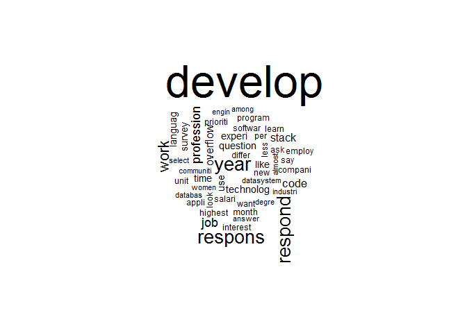
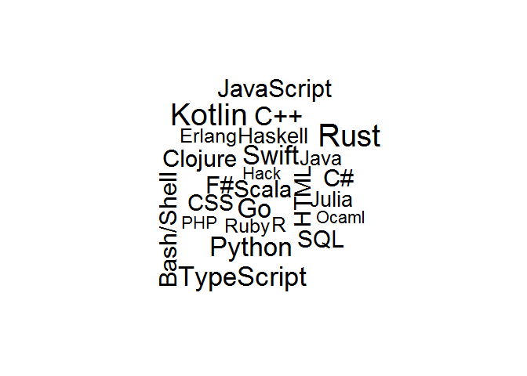
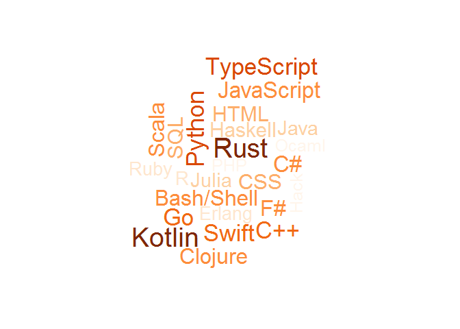

Textual Data Visualization
================

Document to analyze is from: <https://insights.stackoverflow.com/survey/2018/>

So we are seeing what are the most repeated words on this survey.

Setting up environment

``` r
library(tm) #Text library package
```

    ## Warning: package 'tm' was built under R version 3.5.3

    ## Loading required package: NLP

    ## Warning: package 'NLP' was built under R version 3.5.2

``` r
library(SnowballC)
```

    ## Warning: package 'SnowballC' was built under R version 3.5.2

``` r
library(wordcloud)
```

    ## Warning: package 'wordcloud' was built under R version 3.5.3

    ## Loading required package: RColorBrewer

``` r
library(RColorBrewer)
library(readr)


text_file <- read_file("../data/text.txt")
```

Convert into Corpus

``` r
corpus <- Corpus(VectorSource(text_file))
```

To lower case

``` r
corpus <- tm_map(corpus,content_transformer(tolower))
```

    ## Warning in tm_map.SimpleCorpus(corpus, content_transformer(tolower)):
    ## transformation drops documents

Remove Punctuation

``` r
corpus <- tm_map(corpus, removePunctuation)
```

    ## Warning in tm_map.SimpleCorpus(corpus, removePunctuation): transformation
    ## drops documents

Remove stop words

``` r
corpus <- tm_map(corpus, removeWords, stopwords("english"))
```

    ## Warning in tm_map.SimpleCorpus(corpus, removeWords, stopwords("english")):
    ## transformation drops documents

Reduce terms to stems

``` r
corpus <- tm_map(corpus, stemDocument, "english")
```

    ## Warning in tm_map.SimpleCorpus(corpus, stemDocument, "english"):
    ## transformation drops documents

Strip white spaces

``` r
corpus <- tm_map(corpus, stripWhitespace)
```

    ## Warning in tm_map.SimpleCorpus(corpus, stripWhitespace): transformation
    ## drops documents

Convert it to plain text document

``` r
corpus <- tm_map(corpus, PlainTextDocument)
```

    ## Warning in tm_map.SimpleCorpus(corpus, PlainTextDocument): transformation
    ## drops documents

Frequency Words
---------------

``` r
wordcloud(
  words = corpus[1],
  max.words = 50)
```



Quantitative Word Cloud
-----------------------

``` r
words <- read.csv("../data/most_loved_programming_languages.csv")
wordcloud(
  words = words$ProgrammingLanguage,
  freq = words$Percentage,
  scale = c(2.5,0.1))
```



Colored Word Cloud
------------------

``` r
palette <- brewer.pal(
  n = 9,
  name = "Oranges")

colors <- palette[cut(words$Percentage,9)]

wordcloud(
  words = words$ProgrammingLanguage,
  freq = words$Percentage,
  scale = c(2.5,0.5),
  colors = colors,
  ordered.colors = TRUE)
```


